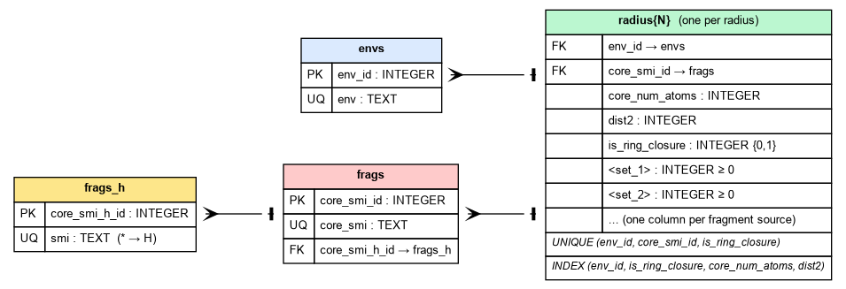

# v1 schema (deprecated)

v1 is the deprecated predecessor of the [v2 schema](schema.md#v2-schema-current).
`cremdb_create` no longer writes it, and reading one raises a `FutureWarning`, but **every
generation function still works against a v1 database** — this page documents its layout for
anyone who has one.

!!! warning "No v1 → v2 converter exists"

    Upgrading would require relabelling the ring-arc fragments, and that cannot be done
    from what a v1 database stores: the attachment-point numbering derives from the `env`
    string, and a radius-truncated `env` is not a re-standardisable molecule — it records
    aromatic atoms whose ring was cut away, so feeding one back through canonicalisation
    either fails or silently rewrites its aromaticity. The upgrade is a rebuild from the
    source SMILES with [`cremdb_create`](build-v2.md).

    `cremdb_convert --target-version 1` can still produce a v1 database from a
    [v0 source](convert.md), which is the one supported way to create one.

{ loading=lazy }

## What is identical to v2

The `envs`, `frags_h` and `frags` tables are exactly as described for
[v2](schema.md#v2-schema-current), including optional [property columns](properties.md) on
`frags` and support for multiple [fragment sets](fragment-sets.md) as count columns on
`radiusN`. The `radiusN` columns `core_num_atoms` and `dist2` also carry the same meaning.

## What differs: ring provenance is a column

```sql
CREATE TABLE radius3(
    env_id           INTEGER NOT NULL,
    core_smi_id      INTEGER NOT NULL,
    core_num_atoms   INTEGER NOT NULL,
    dist2            INTEGER NOT NULL,
    is_ring_closure  INTEGER NOT NULL DEFAULT 0,
    -- one INTEGER count column per fragment set, e.g.:
    chembl           INTEGER NOT NULL DEFAULT 0,
    FOREIGN KEY (env_id)      REFERENCES envs(env_id),
    FOREIGN KEY (core_smi_id) REFERENCES frags(core_smi_id),
    UNIQUE (env_id, core_smi_id, is_ring_closure)
);
CREATE INDEX idx_radius3_lookup
    ON radius3(env_id, is_ring_closure, core_num_atoms, dist2);
```

| Column | Meaning |
|---|---|
| `is_ring_closure` | `0` for acyclic-cut fragments, `1` for ring-cut (ring-closure) fragments — see [frag modes](../concepts.md#fragmentation-modes-frag_mode) |

Provenance is an explicit column that a query filters on, and it is part of the `UNIQUE`
key — so one `(env, core)` pair can hold an acyclic row and a ring-closure row
independently, each with its own per-set counts. To count rows by provenance:

```sql
SELECT is_ring_closure, count(*) FROM radius3 GROUP BY is_ring_closure;
```

(On v2 the equivalent query tests the isotope label in `frags.core_smi` instead, because
the column is gone.)

## Why v2 dropped the column

v1 marks ring-cut attachment points with isotope 1 (`[1*:n]`) only on fragments with
**three or more** attachment points. For a two-attachment ring arc both points are ring
cuts by construction, so there was nothing to disambiguate within the fragment and v1
leaves them unlabelled:

```
v1  two-attachment ring arc   O=C([*:1])[*:2]     <- same string as an acyclic linker
v1  arc + one exo cut         C(C[1*:3])N([*:1])[1*:2]

v2  two-attachment ring arc   O=C([1*:1])[1*:2]   <- distinct string
```

That makes a v1 two-attachment arc textually indistinguishable from an acyclic linker
cut from the same skeleton, which is precisely why the `is_ring_closure` column has to
exist. v2 labels every ring cut, so the strings differ, the `env` becomes
provenance-specific, and the column and its index term become redundant.

## What this means when generating on v1

Two-attachment ring arcs share their `env` with acyclic linkers, so:

- `replace_cycles='partial_all'` / `'partial_exo'` and `make_cycle(ring_closures=True)`
  work, but reach a **narrower fragment space** than the same query against an equivalent
  v2 build, because the shared `env` must be filtered down by the provenance column.
- `link_mols` can reach ring-arc fragments at `radius=1`, where truncation makes a ring
  arc's `env` collapse to the same disconnected form as a linker's. On v2 it draws only
  acyclic-cut linkers, at every radius.

Everything else — `mutate_mol`, `grow_mol`, fragment sets, `min_freq`, property filters,
`filter_func` / `sample_func` — behaves the same on both schemas.

## Identifying a v1 database

```bash
sqlite3 fragments.db "PRAGMA user_version;"   # 1 = v1
```
