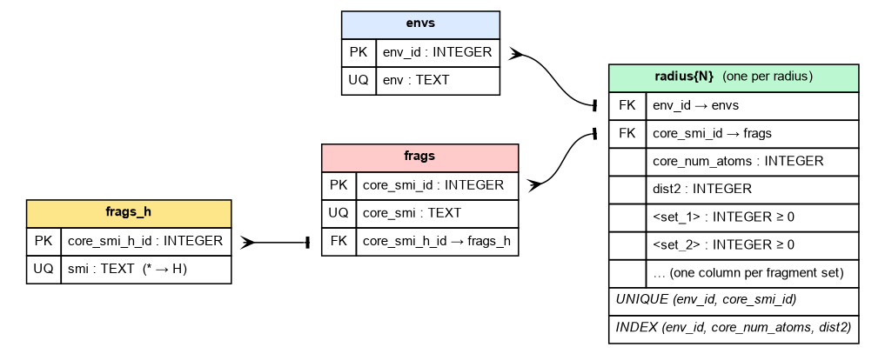
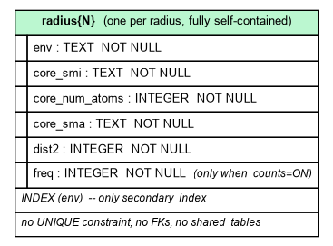

# Database schema

A CReM fragment database is a single SQLite file. CReM reads three formats:

- **v2** — the current, deduplicated schema written by
  [`cremdb_create`](build-v2.md). Identified by `PRAGMA user_version = 2`.
- **v1** — the deprecated predecessor of v2. Structurally identical apart from how
  ring provenance is recorded (see [the v1 page](schema-v1.md)). Still readable, but
  it raises a `FutureWarning` and support may be dropped in a future release.
- **v0** — the legacy single-table-per-radius layout written by the
  [pipeline](build-v0.md). Identified by `PRAGMA user_version = 0` (the default).

Every generation function works with all three formats. v0 databases can be
[converted](convert.md) to v2.

!!! warning "There is no v1 → v2 converter"

    Upgrading v1 to v2 would require relabelling its ring-arc fragments, which cannot be
    done from what a v1 database stores. The upgrade is a rebuild from the source SMILES
    with [`cremdb_create`](build-v2.md). v1 databases keep working in the meantime; only
    two-attachment ring-arc replacement and strict `make_cycle` are limited on them
    (see [the v1 page](schema-v1.md)).

To check a database's format:

```bash
sqlite3 fragments.db "PRAGMA user_version;"   # 2 = v2, 1 = v1, 0 = v0
```

---

## v2 schema (current)

v2 normalizes the data into shared tables so that each environment, fragment,
and H-capped fragment is stored only once, then references them from
per-radius mapping tables.

{ loading=lazy }

### `envs` — context environments

```sql
CREATE TABLE envs(
    env_id  INTEGER PRIMARY KEY AUTOINCREMENT,
    env     TEXT NOT NULL UNIQUE
);
```

One row per distinct canonical context (environment) SMILES.

### `frags_h` — H-collapsed fragments

```sql
CREATE TABLE frags_h(
    core_smi_h_id  INTEGER PRIMARY KEY AUTOINCREMENT,
    smi            TEXT NOT NULL UNIQUE
);
```

Each core fragment with every attachment point `[*]` replaced by hydrogen.
This groups together cores that differ only in where they attach. Deduplicated
by this H-collapsed SMILES.

### `frags` — fragments (cores)

```sql
CREATE TABLE frags(
    core_smi_id    INTEGER PRIMARY KEY AUTOINCREMENT,
    core_smi       TEXT NOT NULL UNIQUE,
    core_smi_h_id  INTEGER NOT NULL,
    FOREIGN KEY (core_smi_h_id) REFERENCES frags_h(core_smi_h_id)
);
```

One row per distinct core SMILES (with attachment points). Optional
[property columns](properties.md) (`mw`, `logp`, …) are added to this table on
demand and are therefore **not** present in a freshly built database.

### `radiusN` — context-to-fragment mapping (one per radius)

```sql
CREATE TABLE radius3(
    env_id           INTEGER NOT NULL,
    core_smi_id      INTEGER NOT NULL,
    core_num_atoms   INTEGER NOT NULL,
    dist2            INTEGER NOT NULL,
    -- one INTEGER frequency column per fragment set, e.g.:
    chembl           INTEGER NOT NULL DEFAULT 0,
    FOREIGN KEY (env_id)      REFERENCES envs(env_id),
    FOREIGN KEY (core_smi_id) REFERENCES frags(core_smi_id),
    UNIQUE (env_id, core_smi_id)
);
```

Each row links a context (`env_id`) to a core (`core_smi_id`) observed in that
context at this radius. Columns:

| Column | Meaning |
|---|---|
| `core_num_atoms` | heavy-atom count of the core (denormalized here so size filters need no join) |
| `dist2` | topological distance between the two attachment points for 2-attachment cores; `0` otherwise |
| *set columns* | one per [fragment set](fragment-sets.md); the value is the occurrence count in that set |

### `radius0` — the no-context table

An optional `radius0` table has the same columns but its `env_id` points at an
attachment-point class (`R2A1`, `R0A2`, …) instead of a context SMILES, because no context
survives at radius 0. It is built only on request; see [Radius 0](radius0.md).

### Ring provenance is in the SMILES, not a column

A fragment cut out of a ring differs from an otherwise identical acyclic fragment in
where it may be re-inserted, so the two must not be interchangeable. v2 records this in
the fragment strings themselves: **every ring-cut attachment point carries isotope 1**,
written `[1*:n]`. A ring arc is therefore

```
core_smi = 'O=C([1*:1])[1*:2]'      env = 'C(-C-C-[1*:1])-C-O-[1*:2]'
```

while the same skeleton cut from acyclic bonds is `O=C([*:1])[*:2]`. The two are
different strings, so they occupy different rows and a query for one cannot return the
other — which is why `(env_id, core_smi_id)` alone is a sufficient `UNIQUE` key.

A useful consequence: `cremdb_create` strips all isotopes from input molecules before
fragmenting, so `[1*` in a stored string is *always* a ring-cut marker and never a real
isotopic label. To count fragments by provenance:

```sql
SELECT CASE WHEN f.core_smi LIKE '%[1*%' THEN 'ring' ELSE 'acyclic' END AS provenance,
       count(*)
FROM radius3 r JOIN frags f ON r.core_smi_id = f.core_smi_id
GROUP BY provenance;
```

### Indices

The `UNIQUE` constraints already create autoindices on `envs(env)`,
`frags(core_smi)`, `frags_h(smi)`, and `radiusN(env_id, core_smi_id)`. In addition,
exactly one covering index per radius supports the hot query path:

```sql
CREATE INDEX idx_radius3_lookup
    ON radius3(env_id, core_num_atoms, dist2);
```

### How a query uses it

At generation time CReM resolves the molecule's context to an `env_id` — labelled or
plain according to whether a ring closure is wanted — then selects matching cores from
`radiusN` filtered by `core_num_atoms` (size), `dist2` (linker/ring geometry), and the
chosen set column against `min_freq`. Provenance needs no predicate because it is already
part of the `env`. The selected `core_smi_id`s are joined to `frags` to obtain the
replacement SMILES.

---

## v1 schema (will be deprecated)

v1 has the same `envs` / `frags_h` / `frags` tables as v2 and differs only in `radiusN`,
where ring provenance is an explicit `is_ring_closure` column (part of the `UNIQUE` key and
of the covering index) rather than an isotope label in the fragment SMILES. It is still
fully supported for structure generation; reading one raises a `FutureWarning`, and there is
no converter to v2 — see the warning at the top of this page.

**[Full v1 layout and what it means for generation →](schema-v1.md)**

---

## v0 schema (legacy)

v0 stores everything denormalized in one table per radius:

{ loading=lazy }

```sql
CREATE TABLE radius3(
    env             TEXT,
    core_smi        TEXT,
    core_num_atoms  INTEGER,
    core_sma        TEXT,      -- core reaction SMARTS
    dist2           INTEGER,
    freq            INTEGER    -- present only when built with occurrence counts
);
CREATE INDEX radius3_env_idx ON radius3(env);
```

The `freq` column exists when the database was built from `sort | uniq -c`
counts (see the [v0 pipeline](build-v0.md)). v0 has no notion of multiple
fragment sets or ring-closure provenance; `set_names` is ignored for v0
databases.

When filtering fragments with extra `**kwargs` (property filters), v0 reads the
named columns from the `radiusN` tables, whereas v1 and v2 read them from `frags` /
`frags_h`.
